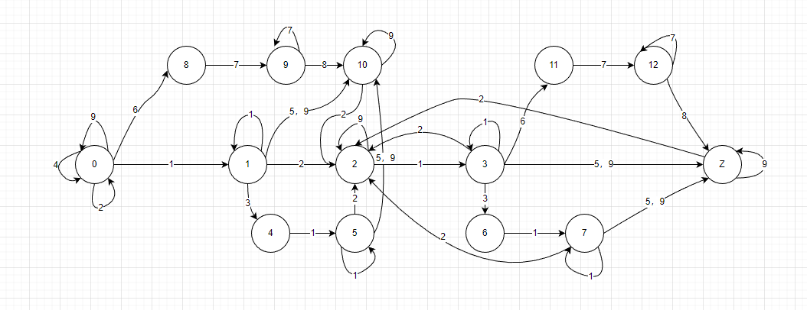

# 表达式分词
一般采用有限状态机（DFA），准确来说是[确定有限状态自动机](https://www.cnblogs.com/dh-dh/p/10245474.html)

还有个非确定有限状态机（NFA）这里不做过多阐述（目前还没有去研究）。NFA采用策略树层次比较深所以效率没有DFA高。一般[NFA先要确定化为DFA然后在对DFA做最小化](https://juejin.cn/post/7022942350355726349)得到一个高效率的状态机（DFA最小化）。

## 示例：[指标名称1] - [指标名称2] * 10.5 / 2 + (3 * [其他指标名称])
首先我们分析公式种的符号种类

1. `10`：参与运算的数字
2. `+-*/%`：算术运算符
3. `.`：小数点
4. `(`：左圆括号
5. `)`：右圆括号（闭合括号）
6. `[`：左中括号
7. `指标名称1`：括号中的字符（规定中英文、数字和下划线组成）
8. `]`：右中括号（闭合中括号）
9. `空格`：\s

> 闲话: 为什么`[、(`和`]、)`要分开他们不是一类符号吗？而`+-*/%`可以放在一起！很简单根据功能区分算术运算符作用就是运算，而括号`()[]`是一体必须成对出现，但是拆开作用就不一样一个表示开始一个表示结束。如果标识成一起很难区分对应的功能。

### 现在再来分析一下公式的合法条件和非法条件(`[]中的内容对应上面拆分符合的编号`)
1. 必须有运算符：23 * 30, 并且是完整的公式结构, `[指标1] - [电脑功率] * `这种就是非法的
2. 只有中括号中的内容是[2]，其他地方出现[2]都是非法的
3. 公式不能以[3, 6, 7]开头
4. `[]`中的字符必须满足[2]条件
5. 算数运算符不能连续出现
6. `'('和')'，'['和']'`必须成对出现
7. 空格既`\s`不能在[2]中出现, [4]后面跟空格之后状态应为数字输入结束状态在输入数字既是非法的如：`10 33`
8. `()`中必须是完整公式 或者 单个运算单元 不能为空


### 结合上述DFA知识和公式字符拆分的合法非法分析，我们可以简单的画出DFA



状态解释
 - `0` 初始状态
 - `1` 整数：`'23' '0'`
 - `2` 缺少右运算单元：`'10 + ' '[指标1] -'`
 - `3` 由数字结尾的完整公式：`'[指标1] + 4' '6 + 44'`
 - `4` 不完整浮点数：`'0.' '3.'`
 - `5` 浮点数：`'0.5' '3.2'`
 - `6` 由浮点数结尾的完整公式(非完整浮点数)：`'23 * 4.' '[名称] + 0.'`
 - `7` 由浮点数结尾的完整公式：`'10 + 23.4' '[名称] + 0.234'`
 - `8` 单个变量表达式开始：`[`
 - `9` 单个变量表达式有内容：`[指标`
 - `10` 单个完整运算单元: `'10 ' '[指标名称]' ‘23.5 ’`
 - `11` 右运算单元为量表达式开始`'10 + ['`
 - `12` 右运算单元为量表达式未结束`'10 + [指标名称'`
 - `z` 最终条件 - 完整公式

 
> 值得注意的是`'('和')'`的处理，和程序代码一样他是可以嵌套的如果要把这个带入单一固定状态那么可能一本笔记本都不够你写的,这里说的有点晦涩难懂，可以把他当作`if {}`中的`{}`他是有自己的作用域的，里面包裹也是一个完整的公式，括号里面还可以嵌入括号操作。所以这没用特定的状态标识他的状态不然那样可是灾难。处理`'('和')'`时候只纪律出现的个数通过个数来判断当前括号有没有完整闭合。

### 绘制DFA表格
绘制成表格直观的表示各个状态的跳转关系

| 状态/事件  | 0     | 1     | 2    | 3     | 4     | 5     | 6     | 7     | 8     | 9     | 10    | 11    | 12    | Z    |
| -------  | ----- | ----- | ----- | ----- | ----- | ----- | ----- | ----- | ----- | ----- | ----- | ----- | ----- |----- |
| 1        | 1     | 1     | 3     | 3     | 5     | 5     | 7     | 7     | 9     | 9     | x     | 12    | 12    |x     |
| 2        | 0 (最多一个)| 2     | x     | 2     | x     | 2     | x     | 2     | x     | x     | 2     | 7     | x     |2     |
| 3        | x     | 4     | x     | 6     | x     | x     | x     | x     | x     | x     | x     | x     | x     |x     |
| 4        | 0     | x     | 2     | x     | x     | x     | x     | x     | x     | x     | x     | x     | x     |x     |
| 5        | x     | 10    | x     | Z     | x     | 10    | x     | Z     | x     | x     | x     | x     | x     |Z     |
| 6        | 8     | x     | 11    | x     | x     | x     | x     | x     | x     | x     | x     | x     | x     |x     |
| 7        | x     | x     | x     | x     | x     | x     | x     | x     | 9     | 9     | x     | 12    | 12    |x     |
| 8        | x     | x     | x     | x     | x     | x     | x     | x     | x     | 10    | x     | x     | Z     |x     |
| 9        | 0     | 10    | 2     | Z     | x     | 10    | x     | Z     | x     | x     | 10    | x     | x     |Z     |

> 好了，DFA的准备工作已经完成，我们再来完成代码部分
```js
const expression = '[指标1 ] + 3)'

const DFA = [
  [1, 1, 3, 3, 5, 5, 7, 7, 9, 9, 'x', 12, 12, 'x'],
  [0, 2, 'x', 2, 'x', 2, 'x', 2, 'x', 'x', 2, 7, 'x', 2],
  ['x', 4, 'x', 6, 'x', 'x', 'x', 'x', 'x', 'x', 'x', 'x', 'x', 'x'],
  [0, 'x', 2, 'x', 'x', 'x', 'x', 'x', 'x', 'x', 'x', 'x', 'x', 'x'],
  ['x', 10, 'x', 13, 'x', 10, 'x', 13, 'x', 'x', 'x', 'x', 'x', 13],
  [8, 'x', 11, 'x', 'x', 'x', 'x', 'x', 'x', 'x', 'x', 'x', 'x', 'x'],
  ['x', 'x', 'x', 'x', 'x', 'x', 'x', 'x', 9, 9, 'x', 12, 12, 'x'],
  ['x', 'x', 'x', 'x', 'x', 'x', 'x', 'x', 'x', 10, 'x', 'x', 13, 'x'],
  [0, 10, 2, 13, 'x', 10, 'x', 13, 'x', 'x', 10, 'x', 'x', 13]
]

let currentState = 0 // 当前状态

let isStartSignSymbol = false // 正负号开头

const parenthesiStack = [] // 小括号栈

const numericRE = /[0-9]/ // 数值正则

const operatorRE = /[+\-*\/%]/ // 运算符正则

const indicatorNameRe = /[a-zA-Z\u4e00-\u9fa5_]/ // 指标名称正则

const spaceRE = /\s/


// 识别器规则
const identifierRules = [
  {
    code: 1,
    ruleType: 'reg',
    reg: numericRE
  }, {
    code: 2,
    ruleType: 'reg',
    reg: operatorRE
  }, {
    code: 3,
    ruleType: 'judgment',
    word: '.'
  }, {
    code: 4,
    ruleType: 'judgment',
    word: '('
  }, {
    code: 5,
    ruleType: 'judgment',
    word: ')'
  }, {
    code: 6,
    ruleType: 'judgment',
    word: '['
  }, {
    code: 7,
    ruleType: 'reg',
    reg: indicatorNameRe
  }, {
    code: 8,
    ruleType: 'judgment',
    word: ']'
  }, {
    code: 9,
    ruleType: 'reg',
    reg: spaceRE
  }
]

/**
 * 字符识别器
 * @param {string} key 
 * @return {number} code
 */
const identifier = (key) => {
  let code = null
  identifierRules.some(rule => {
    let res = false
    if (rule.ruleType === 'reg') {
      res = rule.reg.test(key)
    } else if (rule.ruleType === 'judgment') {
      res = key === rule.word
    }
    code = res ? rule.code : code
    return res
  })
  return code
}

for (let i in expression) {
  const code = identifier(expression[i])

  if (code === 4) {
    isStartSignSymbol = false
    parenthesiStack.push({
      index: i,
      char: '(',
      code
    })
  }
  if (code === 5) {parenthesiStack.pop()}

  if (code === 2 && currentState === 0) {
    if (expression[i] === '+' || expression[i] === '-') {
      if (isStartSignSymbol) currentState = 'x'
      else isStartSignSymbol = true
    } else currentState = 'x'
  }
  currentState = DFA[code - 1][currentState] ?? 'x'
}

```

### 显示具体的错误信息
当我们输入一个不满足条件的表达式时，我们要做的可能不仅仅是验证表达式的格式是否正确。为了更好的用户体验，我们需要将表达式中的不满足的错误信息展示出来
> 当前输入不满足规则时我们，我们只需要记录上一个状态然后更具当前输入类型判断即可，例如：上一个状态是`12`解析出来的表示是`12 + [指标`，然后当前输入的是一个空格不满足条件，我们即可抛出错误信息“'[]'运算单元中间不能出现汉字、大小写字母、数字和_以外的字符”。

**我们将状态和输入类型组合枚举出来**

```js
// 定义错误类型
const errorTypes = {
  illegalCharError: (key) => `"${key}"再当前位置为非法字符`,
  outOfPlaceError: (key) => `"${key}"不能出现再当前位置`,
  operatorError: () => '运算符只能单个出现',
  floatError: (key) => `当前位置只能是数字，但是接收到的是“${key}”`,
  noContentError: () => '"[]"中不可为空',
  spaceError: () => '空格不可出现再此处',
  notAnExpression: () => '这不是一个表达式',
  incompleteExpression: () => '表达式不完整',
  incompleteFloatNumber: () => '表达式末尾浮点数不完整',
  missingParenthesis1: () => '表达式结尾位置缺少“]”',
  missingParenthesis2: (index) => `第${Number(index) + 1}字符位置,"("未闭合`,
}
const errorStateMap = {
  0: {
    2: errorTypes.illegalCharError,
    3: errorTypes.outOfPlaceError,
    7: errorTypes.illegalCharError
  },
  1: {
    4: errorTypes.outOfPlaceError,
    6: errorTypes.outOfPlaceError,
    7: errorTypes.illegalCharError,
    8: errorTypes.illegalCharError
  },
  2: {
   2: errorTypes.operatorError,
   3: errorTypes.outOfPlaceError,
   5: errorTypes.outOfPlaceError,
   7: errorTypes.illegalCharError,
   8: errorTypes.outOfPlaceError,
  },
  4: {
   2: errorTypes.floatError,
   3: errorTypes.floatError,
   4: errorTypes.floatError,
   5: errorTypes.floatError,
   6: errorTypes.floatError,
   7: errorTypes.floatError,
   8: errorTypes.outOfPlaceError,
   9: errorTypes.illegalCharError
  },
  5: {
    3: errorTypes.outOfPlaceError,
    4: errorTypes.outOfPlaceError,
    6: errorTypes.outOfPlaceError,
    7: errorTypes.illegalCharError
  },
  8: {
    2: errorTypes.illegalCharError,
    3: errorTypes.illegalCharError,
    4: errorTypes.illegalCharError,
    5: errorTypes.illegalCharError,
    6: errorTypes.illegalCharError,
    8: errorTypes.noContentError,
    9: errorTypes.spaceError,
  },
  9: {
    2: errorTypes.illegalCharError,
    3: errorTypes.illegalCharError,
    4: errorTypes.illegalCharError,
    5: errorTypes.illegalCharError,
    6: errorTypes.illegalCharError,
    9: errorTypes.spaceError,
  },
  10: {
    1: errorTypes.illegalCharError,
    3: errorTypes.illegalCharError,
    4: errorTypes.illegalCharError,
    6: errorTypes.illegalCharError,
    8: errorTypes.illegalCharError
  },
  13: {
    1: errorTypes.illegalCharError,
    3: errorTypes.outOfPlaceError,
    4: errorTypes.outOfPlaceError,
    5: errorTypes.outOfPlaceError,
    6: errorTypes.illegalCharError,
    7: errorTypes.illegalCharError,
    8: errorTypes.illegalCharError
  }
}

Object.assign(errorStateMap, {
  3: errorStateMap[1],
  6: errorStateMap[4],
  7: errorStateMap[5],
  11: errorStateMap[8],
  12: errorStateMap[9],
})

```
