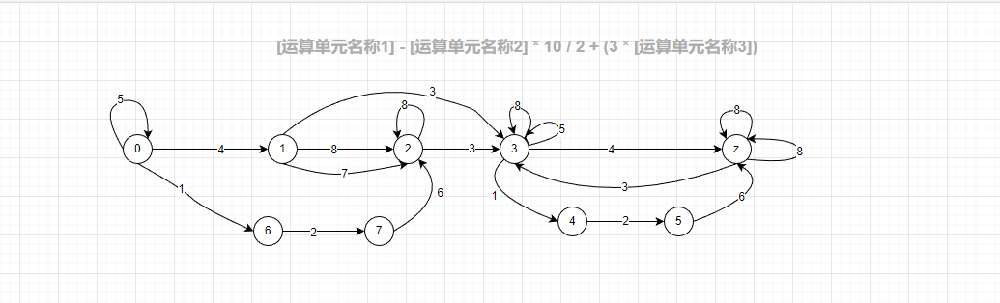

# 表达式分词
一般采用有限状态机（DFA），准确来说是[确定有限状态自动机](https://www.cnblogs.com/dh-dh/p/10245474.html)

还有个非确定有限状态机（NFA）这里不做过多阐述（目前还没有去研究）。NFA采用策略树层次比较深所以效率没有DFA高。一般[NFA先要确定化为DFA然后在对DFA做最小化](https://juejin.cn/post/7022942350355726349)得到一个高效率的状态机（DFA最小化）。

## 示例：[指标名称1] - [指标名称2] * 10 / 2 + (3 * [其他指标名称])
首先我们分析公式种的符号种类

1. `[`：左中括号
2. `指标名称1`：括号中的字符（规定中英文、数字和下划线组成）
3. `+-*/%`：算术运算符
4. `10`：参与运算的数字
5. `(`：左圆括号
6. `]`：右中括号（闭合中括号）
7. `)`：右圆括号（闭合括号）
8. `空格`：\s

> 闲话: 为什么`[、(`和`]、)`要分开他们不是一类符号吗？而`+-*/%`可以放在一起！很简单根据功能区分算术运算符作用就是运算，而括号`()[]`是一体必须成对出现，但是拆开作用就不一样一个表示开始一个表示结束。如果标识成一起很难区分对应的功能。

### 现在再来分析一下公式的合法条件和非法条件(`[]中的内容对应上面拆分符合的编号`)
1. 必须有运算符：23 * 30, 并且是完整的公式结构, `[指标1] - [电脑功率] * `这种就是非法的
2. 只有中括号中的内容是[2]，其他地方出现[2]都是非法的
3. 公式不能以[2, 3, 6, 7]开头
4. `[]`中的字符必须满足[2]条件
5. 算数运算符不能连续出现
6. `'('和')'，'['和']'`必须成对出现
7. 空格既`\s`不能在[2]中出现, [4]后面跟空格之后状态应为数字输入结束状态在输入数字既是非法的如：`10 33`
8. `()`中必须是完整公式 或者 单个运算单元 不能为空

### 结合上述DFA知识和公式字符拆分的合法非法分析，我们可以简单的画出DFA

状态解释
 - `0` 初始状态
 - `1` 非公式 - 单个运算单元(未结束)：`23`
 - `2` 非公式 - 输入结束状态：`'10 '、'[指标1]'、'[指标1] '`
 - `3` 非完整公式如：`'[指标1] - [电脑功率] * '`
 - `4` 非完整公式如：`'10 + ['`
 - `5` 非完整公式如：`'10 + [指标1'`
 - `6` 非公式 - 单个`'['`
 - `7` 非公式 - 单个`'[指标1'`
 - `z` 最终条件 - 完整公式

 
> 值得注意的是`'('和')'`的处理，和程序代码一样他是可以嵌套的如果要把这个带入单一固定状态那么可能一本笔记本都不够你写的,这里说的有点晦涩难懂，可以把他当作`if {}`中的`{}`他是有自己的作用域的，里面包裹也是一个完整的公式，括号里面还可以嵌入括号操作。所以这没用特定的状态标识他的状态不然那样可是灾难。处理`'('和')'`时候只纪律出现的个数通过个数来判断当前括号有没有完整闭合。

### 绘制DFA表格
绘制成表格直观的表示各个状态的跳转关系

| 状态/事件  | 0     | 1     | 2    | 3     | 4     | 5     | 6     | 7     | Z     |
| -------  | ----- | ----- | ----- | ----- | ----- | ----- | ----- | ----- | ----- |
| 1        | 6     | x     | x     | 4     | x     | x     | x     | x     | x     |
| 2        | x     | x     | x     | x     | 5     | 5     | 7     | 7     | x     |
| 3        | x     | 3     | 3     | x     | x     | x     | x     | x     | 3     |
| 4        | 1     | 1     | x     | Z     | 5     | 5     | 7     | 7     | x     |
| 5        | 0     | x     | x     | 3     | x     | x     | x     | x     | x     |
| 6        | x     | x     | x     | x     | x     | z     | x     | 2     | x     |
| 7        | x     | x     | x     | x     | x     | x     | x     | x     | z     |
| 8        | 0     | 2     | 2     | 3     | x     | x     | x     | x     | z     |

